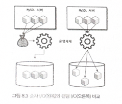
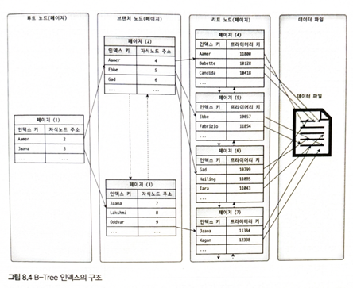
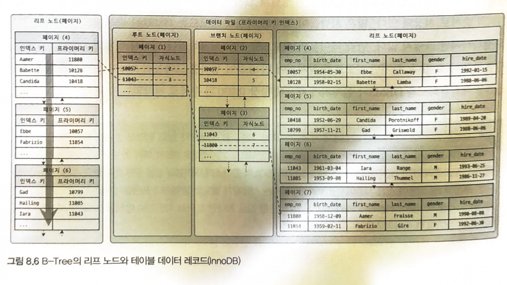
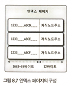
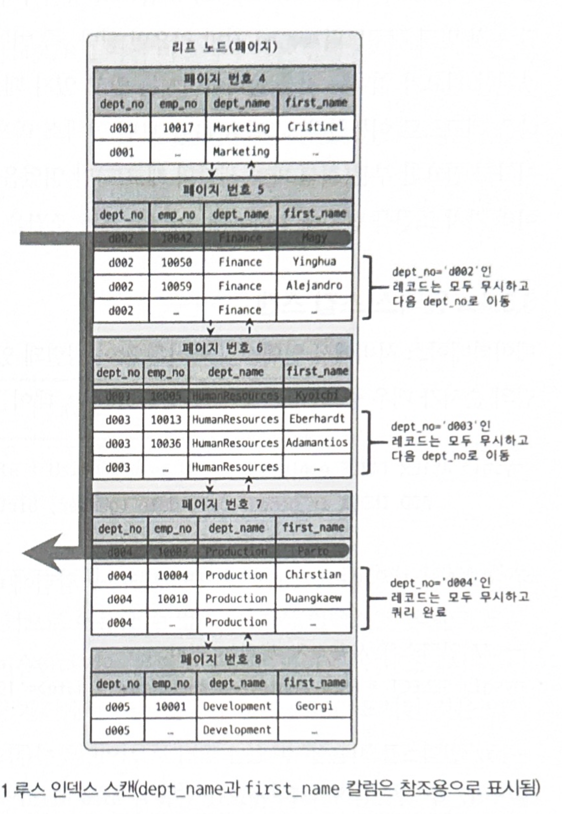

인덱스는 쿼리 튜닝의 기본임. 
mysql에서 사용 가능한 인덱스 종류 및 특성에 대해서 살펴보자.

mysql 서버의 옵티마이저가 발전하고 성능이 개선되었다고 해도 여전히 관리자의 역할은 매우 중요하다. 

---
# 8.1 디스키 읽기 방식
CPU나 메모리처럼 전기적 특성을 띈 장치의 성능은 매우 좋아짐.
반면, 디스크 같은 기계식 성능은 상당히 제한적으로 발전함. 
최근에는 SSD 드라이브가 많이 활용되고 있지만, 여전히 데이터 저장 매체는 컴퓨터에서 가장 느린 부분임. 

데이터베이스 성능 튜닝은 어떻게 디스크 I/O를 줄이느냐가 관건일 때가 상당히 많다. 

## 8.1.1 하드 디스크 드라이브(HDD)와 솔리드 스테이트 드라이브(SDD)
SSD는 HDD를 대체하는 전자식 장치임. 인터페이스가 같아서 대체해서 사용 가능.
전원 공급되지 않아도 데이터 보존 가능. 

SSD는 순차 IO에서는 HDD 와 큰 차이를 보이지 않으나, 랜덤 IO에서는 큰 차이를 보인다. 

데이터베이스 작업은 랜덤 IO가 대부분이다. SSD의 장점은 DBMS용 스토리지에 최적이라고 볼 수 있다.  

---
## 8.1.2 랜덤 IO와 순차 IO
랜덤 IO라는 표현은 하드 디스크 드라이브의 플래터를 돌려서 읽어야 할 `데이터가 저장된 위치`로 `디스크 헤더`를 이동시킨 다음 데이터를 읽는 것을 의미하는데,
사실 순차 IO 또한 이 작업 과정은 같다. 



순차 IO: 3개의 페이지를 디스크에 기록하기 위해 1번 시스템 콜 요청 -> 데이터 읽기 위해서 헤더 1번 이동
랜덤 IO: 3개의 페이지를 디스크에 기록하기 위해 3번 시스템 콜 요청 -> 데이터 읽기 위해서 헤더 3번 이동

디스크에 데이터를 쓰고 읽는 데 걸리는 시간은 디스크 헤더를 움직이는데서 결정된다.

디스크의 성능은 디스크 헤더의 위치 이동 없이 얼마나 많은 데이터를 한 번에 기록하느냐에 의해 결정된다.

DB에서는 이런 작은 데이터 읽고 쓰기가 빈번해서, buffer기능이 내장되어 있다.

SSD에서는 순차 IO와 랜덤 IO가 차이가 없을 것 같지만, 차이가 있다. 그래서 항상 스팩을 나눠서 명시한다.

성능 튜닝에서는 랜덤 IO를 순차 IO로 바꿔서 줄이는건 많지 않다. 그보다는 랜덤 IO자체를 적게 하는 것을 필요로 한다.

쿼리를 처리하는데 꼭 필요한 데이터만 읽도록 하는 것이다. ==> 인덱스 사용

---
# 8.2 인덱스란?
인덱스로 정한 키값을 것을 기준으로 `정렬`하는 것이 핵심이다. 항상 키 값을 기준으로 정렬된 상태로 유지된다.

저장 과정은 복잡하지만, 읽기는 매우 빠르다. 저장과 읽기의 트레이드 오프다. 

select 쿼리 문에서 where 조건이라고 모두 인덱스 걸면 안된다.

인덱스는 데이터 관리 방식(알고리즘)과 중복 값의 허용 여부 에 따라 여러가지로 나눠볼 수 있다.

### 역할
로 나눠보면 pk와 secondary key(pk 아닌 것)로 나눌 수 있다.

### 알고리즘 
B-Tree인덱스와 Hash 인덱스로 나눌 수 있따. 

- b-tree : 칼럼 값을 변경하지 않고 원래의 값을 이용해 인덱싱하는 알고리즘
- hash : 칼럼 값으로 해시값을 계산해서 인덱싱하는 알고리즘. 매우 빠른 검색을 지원한다. 
하지만 값을 변형해서 인덱싱하므로 prefix 일치와 같이 값의 일부만 검색하거나 범위를 검색할 때는 해시 인덱스를 사용할 수 없다.
- 주로 메모리 기반의 데이터베이스에서 많이 사용한다.

### 중복 허용 여부
- 유니크 인덱스
- 유니크 하지 않은 인덱스

---
# 8.3 b-tree 인덱스(balance tree)
가장 많이 사용, 가장 일반적임.
칼럼의 원래 값을 변형시키지 않고, 인덱스 구조체 내에서는 항상 정렬된 상태로 유지한다. 

## 8.3.1 구조 및 특성 



(innoDB 에서 세컨더리 인덱스로 검색하는 경우에는 프라이머리 인덱스 검색을 한번 더 하게 된다.)

루트 노드 - ... 브랜치 노드 ... - 리프 노드

리프노드 : 실제 데이터를 찾아가기 위한 주솟값을 가지고 있음.

데이터 파일의 레코드는 저장된 순서대로 저장되는건 아니다. 삭제되면서 빈 공간이 생기면, insert는 삭제된 공간을 재사용하도록 DBMS가 설계되어 있다.

## 8.3.2 B-Tree 인덱스 키 추가 및 삭제 
### 8.3.2.1 인덱스 키 추가
B-Tree에 저장될 때는 저장될 키 값을 이용해 B-Tree 상의 적절한 위치를 검색해야 한다.
저장 위치가 결정되면 키 - 대상 레코드 주소정보를 리프 노드에 저장한다. 
리프 노드가 꽉 차면 리프 노드가 분리(split) 되어야 한다. 이는 상위 브랜치 노드까지 작업 범위가 확장된다. 
-> 이로 인해 상대적으로 쓰기 작업에 비용이 많이 든다.

대략적인 추정을 해보면, 테이블에 데이터 추가를 1이라고 가정하고 인덱스에 데이터 추가를 1.5라고 가정한다.
만약 해당 테이블에 3개의 인덱스가 있다면, (1.5*3)+1 => 5.5 의 비용이 소요된다.
이때 대부분의 비용이 `디스크로부터 인덱스 페이지를 읽고 쓰기`를 해야해서 걸리는 시간이다.

innoDb의 경우 프라이머리 키나 유니크 키처럼 중복체크를 해야하는 키의 경우 바로 반영하고, 그렇지 않으면 쓰기 지연을 한다.
(디스크 I/O 최소화 목적)

### 8.3.2.2 인덱스 키 삭제
헤딩 키 값이 저장된 b-tree의 리프노드를 찾아서 삭제 마크만 하면 된다. mysql 5.5이상 innoDb 스토리지 엔진에서는 이 작업도 지연처리 가능하다.

### 8.3.2.3 인덱스 키 변경
인덱스의 키 삭제 -> 새로운 키 추가 식으로 진행된다.  

### 8.3.2.4 인덱스 키 검색
트리 검색 : 루트노드 -> 브랜치 노드 -> 리프노드까지 이동하며넛 비교 작업 수행
- 100% 일치 또는 값의 앞부분만 일치하는 경우에 사용 가능
- 부등호 사용 가능
- 뒷부분만 검색하는 것은 불가능
- 키 값을 변형해 비교되는 경우(함수나 연산)도 사용 불가능

innoDb에서는 넥스트 키락이나 레코드 락으로 검색을 수행하는 인덱스를 잠근 후 테이블의 레코드를 잠근느 방식으로 구현되어 있음.
따라서 update, delete 문장이 실행될 때, 테이블에 적절히 사용할 수 있는 인덱스가 없으면 불필요하게 많은 레코드를 잠근다. 
심지어 테이블의 모든 레코드를 잠글수도 있음.

## 8.3.3 b-tree 인덱스 사용에 영향을 미치는 요소
- 키 값의 크기
- b-tree의 깊이
- 선택도, 기수도
- 조회 레코드의 갯수

### 8.3.3.1 인덱스 키 값의 크기
InnoDB 스토리지 엔진에 저장할 수 있는 가장 작은 단위를 Page, Block이라고 한다. 
페이지는 InnoDB 스토리지 엔진의 버퍼 풀에서 데이터를 버퍼링 하는 기본 단위이기도 하다.
인덱스도 결국 페이지 단위로 관리된다. 루트, 브랜치, 리프 노드를 구분하는 기준도 페이지 단위이다.

mysql b-tree는 자식 노드 몇개까지 가질까?
페이지의 기본 크기는 4kb~64kb까지지만, 보통 16kb이다.


1024 * 16 / (16+12) =585개의 자식 노드를 가질 수 있다.
만약 인덱스 키 값의 크기가 커지면 어떻게 될까? 32바이트로 늘어났다고 해보자.
16* 1024 / (32+12) = 372개이다.

select 쿼리로 500개의 레코드를 읽어야 한다면 전자는 한번에 읽을 수 있지만, 후자는 2번을 읽어야 한다.
즉, 키 값이 커지만 디스크 I/O가 더 심해진다.

또 메모리 공간이 한정되어 있기 때문데, 메모리 효율도 떨어진다.

### 8.3.3.2 B-Tree의 깊이
깊이는 중요하지만, 직접 제어할 수 있는 방법은 없다.
깊이가 3이고, 키 값의 크키가 16바이트라면, 585 * 585 * 585 해서 2억개 정도를 저장할 수 있다.
32바이트로 늘어나면 5천만개로 줄어든다.
b-tree의 깊이는 조회할 때, 랜덤 디스크 I/O가 얼마나 일어나는지의 문제이다.
아무리 대용량이라 하더라도 5단계 이상 깊어지는 경우는 많지 않다.

### 8.3.3.3 선택도, 기수도
인덱스 키 값 가운데 유니크한 값의 갯수.
전체 100개의 인덱스 중에 고유한 유니크가 10개라면 기수성은 10이다. 
유니크할 수록 기수성은 높아지고, 선택도도 높아진다.

인덱스는 선택도가 높을수록 중복이 적어지므로 성능이 올라간다.

### 8.3.3.4 조회 레코드 갯수


## 8.3.4 b-tree 인덱스를 통한 레코드 읽기
### 8.3.4.1 인덱스 레인지 스캔
인덱스를 통해서 데이터를 읽어오는 것
- 인덱스 탐색 : 인덱스에서 조건을 만족하는 값이 저장된 위치를 가져온다. 
- 인덱스 스캔 : 1번에서 탐색된 위치부터, 필요한 곳까지 인덱스를 쭉 읽는다.
- 스캔한 인덱스의 키와 레코드 주소로 레코드가 저장된 페이지를 가져오고, 최종 레코드를 가져온다.

3번 과정은 커버링 인덱스의 경우 필요하지 않아 랜덤 I/O가 많이 줄어든다.
(커버링 인덱스 : 인덱스에 조회하고자 하는 칼럼이 모두 있어서, 따로 원본 테이블을 조회하지 않아도 되는 경우)

### 8.3.4.2 인덱스 풀 스캔
인덱스 레인지 스캔과 달리 인덱스를 모두 읽는 것. 인덱스 레인지스켄보다는 덜 좋지만, 테이블 풀스캔 보다는 좋다.
인덱스가 (A,B,c) 순서로 만들어졌는데, B나 C로 읽으면 발생한다.
인덱스가 테이블보다는 작으므로 효율적이다. 쿼리가 인덱스에 명시된 칼럼만으로 처리 가능할 때 이를 사용한다.

### 8.3.4.3 루스 인덱스 스캔
느슨하게 또는 듬성듬성하게 인덱스를 읽는 것을 의미한다.
인덱스 레인지 스캔과 비슷하게 작동하지만, 중간에 필요치 않은 인덱스 키 값은 무시하고(SKIP) 다음으로 넘어가는 형태로 처리한다.
일반적으로 GROUP BY, 집합함수 가운데서는 MIN(), MAX()에 대한 최적화 하는 경우에 사용된다.

```mysql
SELECT dept_no, MIN(emp_no)
FROM dept_emp
WHERE dep_no BETWEEN 'd002' AND 'd004'
GROUP BY dept_no;
```
위 쿼리에서 인덱스가 (dept_no, emp_no)로 생성되어 있다고 한다. 그러면 where절의 범위를 모두 읽을 필요가 없다. 



### 8.3.4.4 인덱스 스킵 스캔
핵심은 값이 정렬되어 있다는 것이다. 
원래는 만약 다중 인덱스로 생성되었다면(gender, date), date만으로는 검색일 불가능했으나, 
mysql 8.0버전 부터는 옵티마이저가 gender 칼럼을 건너뛰어서 date 만으로 인덱스 검색이 가능하게 해주는 인덱스 스킵 스캔 최저고하 기능이 도입되었다.

루스 스캔은 group by 절의 최적화를 위해서 사용되었지만, 인덱스 스킵 스캔은 where 절의 검색을 위해 사용 가능하도록 용도가 훨씬 넓어졌다.

mysql 옵티마이저는 우선 gender 칼럼에서 유니크한 값을 모두 조회해서 주어진 쿼리에 gender 칼럼의 조건에 추가해서 실행한다.

단, 커버링 인덱스여야 한다.

그리고 유니크한 인덱스 값이 많다면, 오히려 random IO가 많아져서 성능이 더 떨어질 수 있다.

## 8.3.5 다중 칼럼 인덱스 

## 8.3.6 b-tree 인덱스의 정렬 및 스캔 방향
mysql 8.0 이후 부터는
`create index test on employees (name ASC, seq DESC);`와 같이 혼합해서 생성할 수 있게 되었다.

### 8.3.6.1.1 인덱스 스캔 방향
생성 시에는 하나의 정해진 방향으로 생성하지만, 읽을 때는 읽는 시작점에 따라서 정렬이 정방향 역방향 선택될 수 있다. 
읽기 방향을 전환해서 사용하도록 실행 계획을 만들어 낸다. 

### 8.3.6.1.2 내림차순 인덱스 
조회 시 역순 정렬 쿼리가 정순 정렬 쿼리보다 30% 가량 느리다.
간단하게 생각하면 링크드 리스트의 읽는 것의 차이일 뿐이지만, innoDB에서 내부적 이유는 다음과 같다.
